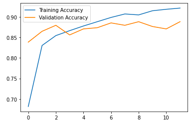

## Clothes Classification with Convolution Neural Nets [[view code]]
(link)
**The code is available [here](link)
<p>
<a align ='center'></a>
<a href="#goal">Goal</a>
<a href="#over"> Overviwew and Data</a>
<a href="#augm"> Preprocessing and Data Augmentation</a>
<a href="#small datasets"> Problems with small datasets </a>
<a href="#xception">Loading the Xception model</a>
<a href="#clothes_model">Building the full model</a>
<a href="#plots">Plotting the accuracy and loss histories</a>
</p>

<a id='goal></a>
## Goal
The goal of this project is tuo use Transfer Learning to classify clothes.

<a id='over'></a>
## Overview and Data
The data consisted in 3781 images distrbuted as follows:<br>
- train: Images for training a model (3,068 images)
- validation: Images for validating (341 image)
- test: Images for testing (372 images)

I used `keras` to build a fully-connected neural network based on deep learing model `Xception` using Transfer Learning.
<a id='aug'></a>
### Preprocessing and Data Augmentation
  - Image resizing to 299*299
  - Data augmentation is useful when we have small dataset to generate more data. The Transfomation I did it are :
  	- shear
	- zoom
	- Horizontal filp
`keras.preprocessing.image.ImageDataGenerator` it defines the configuration of image data preparation and image data augmentation. It generate small batches of image instead of loading the entire dataset into the memory, this can be helpful to treat big dataset.
```
train_gen = ImageDataGenerator(
    shear_range=10.0,
    zoom_range = 0.1,
    horizontal_flip = True,
    preprocessing_function=preprocess_input
    )
train_ds = train_gen.flow_from_directory(
    "clothing-dataset-small/train",
    target_size=(299,299),
    batch_size=32
)
```

<a id='Small datasets'></a>
## Problems with small datasets
Given the small dataset we have it's difficult to build a model that make predictions with high accuracy.We have a risk of overfitting.

To achieve the level of performance of current state-of-the-art models millions of training examples are typically needed.

<a id="xception"></a>
## Loading Xception model
Load the Xception model without the fully connected layer`(include_top=False)` and load the weights of ImageNet`(weights=imagnet)`.
```
# level feature 
xception_model= Xception(weights ="imagenet",
                 include_top= False,
                 input_shape=(299,299,3)
                 )
#freeze the model, we don't want to train it 
xception_model.trainable= False
```
<a id="clothes_model"></a>
## Building the full model
The small fully-connected network is built and trained below. I used:
- CategoricalCrossentropy as loss function
- The `Adam` optimizer
- Learning rate = 0.01
```
  #the input shape should be (299,299,3)
inputs =keras.Input(shape=(299,299,3))

  #use the base_model to extract high level features
base =xception_model(inputs= inputs,training=False)

  #convert the base model output to a vector 
vector_presentation = keras.layers.GlobalAveragePooling2D()(base)
  #add a dense layer of size 100 
inner_dense = keras.layers.Dense(100)(vector_presentation)

  #add a dropout layer with 0.5 
drop = keras.layers.Dropout(0.5)(inner_dense)

  #add dense layer of size 10: one element for each class 
outputs = keras.layers.Dense(10)(vector_presentation)

  #combine the inputs and outputs to build a keras model 
model = keras.Model(inputs,outputs)

learning_rate = 0.001
optimizer = keras.optimizers.Adam(learning_rate)
loss = keras.losses.CategoricalCrossentropy(from_logits=True)

model.compile(
    optimizer=optimizer,
    loss=loss,
    metrics=['accuracy']
)
history = model.fit(train_ds,epochs=12,validation_data=val_ds)
```
<a id='#plots'></a>
## Plotting the accuracy and loss histories
<br>

<p align="center">
  
</p>    


                                 
<br> 
